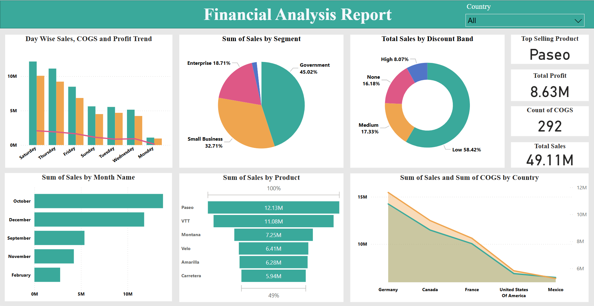

# Financial_Analysis_Report - Power BI Dashboard

An interactive Power BI dashboard analyzing sales, profit, and manufacturing costs across products, countries, and market segments - built to support data-driven business decision-making.

## Project Overview

This project uses a financial dataset containing sales, profit, and manufacturing cost details across multiple products, countries, and customer segments. The goal is to turn raw trasactional data into a set of clear, actionable insights for business stakeholders.

## Objectives

The dashboard was built to answer the following business questions:

1. **Top-seeling products** - Identify the top-selling product by country and segment, and determine the profit generated by each product.
2. **Discount impact** - Analyze how discount bands affect units sold and gross sales, by product, country, and segment.
3. **Seasonality** - Identify which months of the year generate the most sales and profit across all countries and segments.
4. **Pricing analysis** - Determine the relationship between manufacturing price and gross sales, and flag products/segments with potential pricing issues.
5. **Cost analysis** - Analyze Cost of Goods Sold (COGS) per product to identify any products with excessive costs that reduce overall profit.
6. **Country & segment performance** - Evaluate the sales and profit performance of each country and segment, and highlight areas for improvement.
7. **Daily sales trends** - Identify which days of the week generate the highest sales volume.

## Tools and Techniques

- **Power BI Desktop** - data modeling, visualization, and dashboard desing.
- **DAX (Data Analysis Expressions)** - custom measures and calculated columns for profit, margin, discount impact, and time-based aggregations
- **Power Query** - data cleaning and transformation

## Dashboard Preview

## Key Insights

- **Paseo** is the top-selling product overall, generating **$12.3M** in sales - followed by VIT ($11.08M) and Montana ($7.25M)
- **Government** is the leading customer segment, contributing **45.02%** of total sales, followed by Small Business (32.71%) and Enterprise (18.71%). The dataset includes 5 segments total (Government, Small Business, Enterprise, Channel Partners, Midmarket); the two smaller segments have a limited share and don't appear as distinct slices in this view.
- **58.42%** of total sales came from orders with a **Low discount band**, suggesting heavy discounting isn't the main sales driver - while High-discount orders contributed only 8.07%.
**October and December** are the strongest months for sales, while **February** is the weakest - pointing to a clear seasonal pattern worth planning around.
**Saturday** sees the highest combined sales, COGS, and profit, with a general decline in profit margin trend across the week toward Monday.
**Germany and Canada** lead in both sales and COGS among the five countries analyzed, while the **United States and Mexico** show comparatively lower sales and cost volumes.
- Across the full dataset: **Total Sales: $49.11M**, **Total Profit: $8.63M**, with 292 COGS records analyzed.
